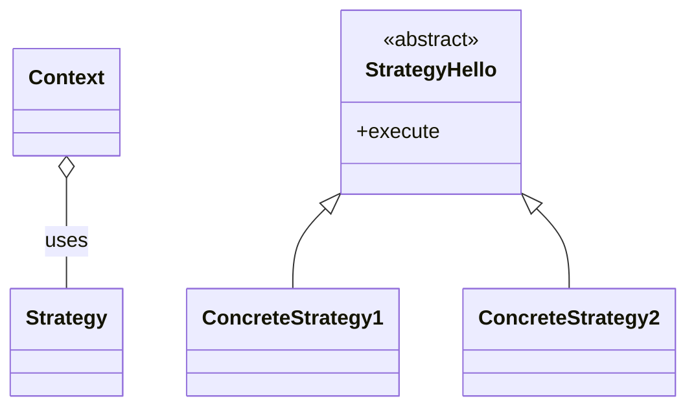

# Table of Contents
- [Table of Contents](#table-of-contents)
- [Calculator](#calculator)
- [What to solve?](#what-to-solve)
  - [Example outcome:](#example-outcome)
  - [Reverse Polish Notation](#reverse-polish-notation)
- [How to approach this problem?](#how-to-approach-this-problem)
- [Stack Implementation :book:](#stack-implementation-book)
    - [Properties:](#properties)
    - [Constructor and Methods](#constructor-and-methods)
- [Bug or suggestions :bug:](#bug-or-suggestions-bug)
- [Reference](#reference)

# Calculator
 - A java program that calculates a simple expression **string**. In this project, I learned how to code my own implementation of *Stack* and *Queue* as well as using the *Reverse Polish Notation*. I did not rely on any of the built-in methods from java.utils.

This is a fun and challenging project that helps me to further understand data structures.

---
#  What to solve?

 - Assumed that the expression string does not contains negative numbers. It should only contains  '+', '-', '*', '/' operators and open '(' and closing parenthesis ')'. Make sure that integer division should truncate towards *zero*. Additionally, assumed that the given expression is always valid. You may use any of the ADTs implementation to built this program.

 - You must not use any built-in function which evaluates string as mathematical expressions, such as eval(). You will have to fully implement the ADT. Lastly, You are not allowed to use any implementation from java.utils.*;

## Example outcome:
```
input: str = "1+1"
output: 2
```
```
input: str = "(2+6*3+5-(3*14/7+2)*5)+3"
output: -12
```
```
input str = "2*(5+5*2)/3+(6/2+8)"
output: 21
```
---
## Reverse Polish Notation
- A **Revers Polish Notation** or **PostFix Notation** is a mathematical notation in which operators follow their operands. For example of infix notation: 3+5 is represented as 3,5,+ in postfix notation. Another example, infix notation 2*(5+5*2)/3+(6/2+8) is represented as 2,5,5,2,*,+,*,3,/,6,2,/,8,+,+ in postfix notation.
- Check this article for more detailed explanation
  - [RPN](https://mathworld.wolfram.com/ReversePolishNotation.html)

# How to approach this problem?
    - [] Implement Stack
    - [] Implement Queue
    - [] Tokenize string input
    - [] implement Reverse Polish Notation

---
# Stack Implementation :book:

- Stack is a linear data structure which follows a particular order in which the operation are performed. The order may be LIFO(Last in First Out) or FILO(First in Last Out)
- We have to make our own implementation of Stack class
- The main methods for Stack are:
  - `push()`
  - `peek()`
  - `pop()`

![class][stackUML]


### Properties:
  - **top** is an index that keeps track of the number of the element(s) inside the stack
  - **DEFAULT_SIZE** is a variable for the initial size of the stack if the constructor is called without a parameter.
  - **element** is an array container for the elements.
  - **capacity** is determines the actual size of the stack

### Constructor and Methods
- **StackImp()** the constructor either initialize the stack with a specific size or initialize it with the default value if no argument is given.
- **isEmpty()** returns a boolean value if top is less than 0;
- **isFull()** returns a boolean if top is equal to the capacity.
- **getSize()** return the value of top.
- **clear()** changes the value of top to -1;
- **push()** takes an item to be added into the stack. Throws an exception if the stack is full.
- **pop()** return and remove the last item in the stack. Throws an exception if the stack is empty.
- **peek()** returns the last item in the stack. It does not remove the item in the stack. Throws an exception if the stack is empty.
- **toString()** displays a nicely formatted stack.
# Bug or suggestions :bug:
- If you a bug or would like to contribute feel free to contact me. 



# Reference
[GeeksForGeeks][geekforgeek]


<!-- Link here -->
[geekforgeek]:https://geeksforgeeks.org/stack-data-structure/
[stackUML]:https://www.plantuml.com/plantuml/svg/LP3F2i8m38VlVOeUEuOlC2yJt63WhVEYYDGQPh7_MBF35D_ThQCER_c-v1T2oe2Yny5e8hK8WN8KyjaO_oQKRYWwNr1bCSA-gdV7GtlbpQcYgmOD1Yo6OXBdIrHIU24LZcae_wrbMKGLAkDnP5b1Ryvf43RcLAW7hVzjJZj0hbumwxHEJisUPTi8VWWFrgOxadH-3hGB03nNGiUnLxQRpLAH3od1tgSlV040 "stack diagram"
